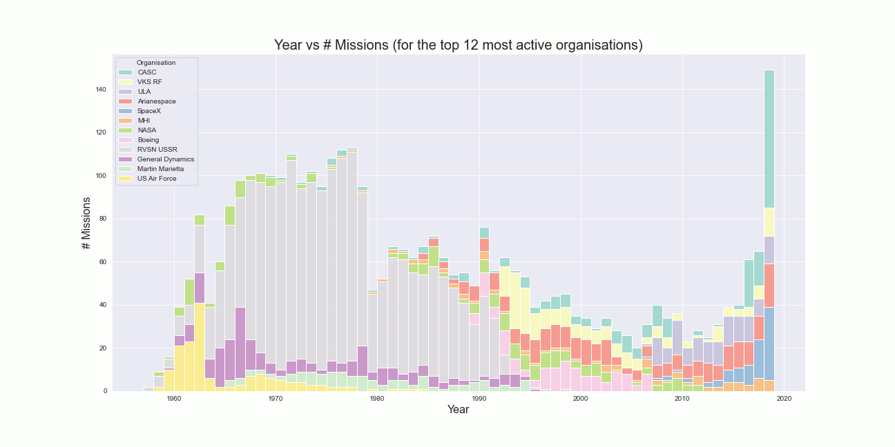

# :rocket: Space Exploration (Explored)

*A notebook that uses python, pandas, matplotlib, and seaborn to explore a dataset related to space exploration. Go [here](notebook/Markdown/ExploringSpaceExploration.md) to view the notebook itself.*

## Getting Started

1) Get the data! It's available on kaggle here: [all-space-missions-from-1957](https://www.kaggle.com/agirlcoding/all-space-missions-from-1957).
2) Fork or download this repository.
3) Put the downloaded data (a CSV file) inside the *data* folder. If you like, delete the README in the *Data* folder as well.
4) Open up and run the notebook!

