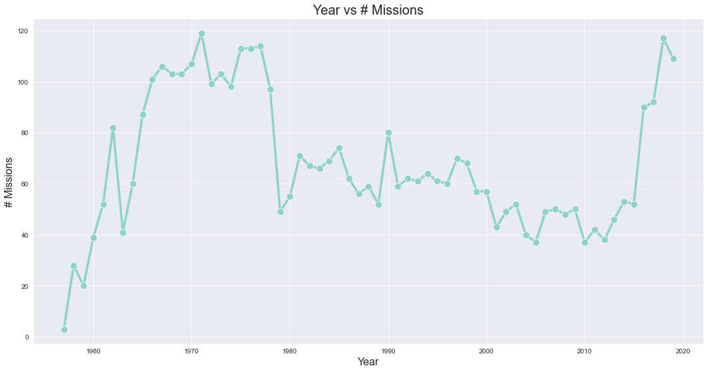
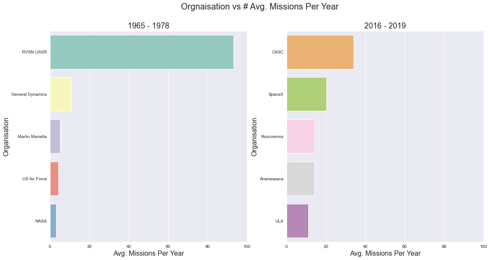
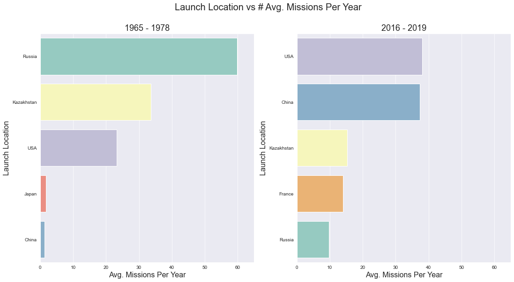
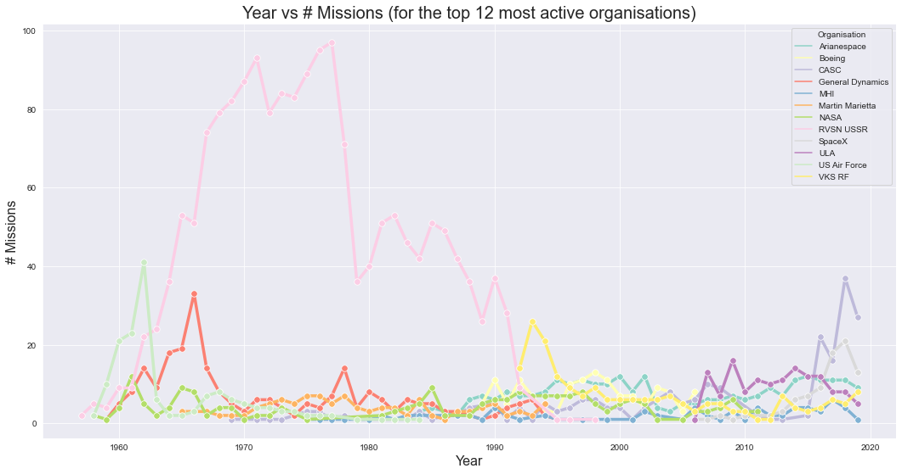
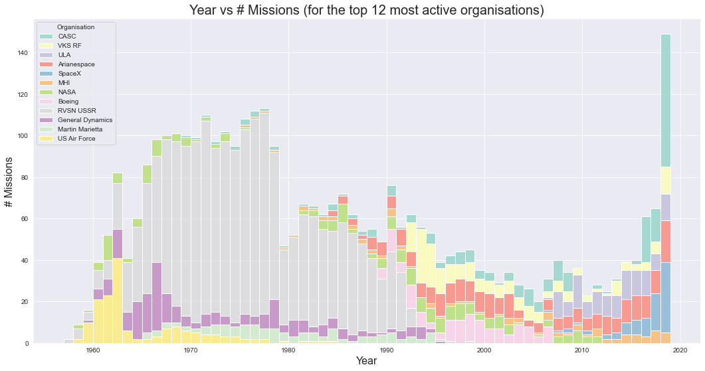

# 🚀 Space Exploration (Explored)

##  ⏬ Importing libraries


```python
# import libraries
import pandas as pd
import numpy as np
import matplotlib.pyplot as plt
import seaborn as sns
```

## 📚 Reading the data


```python
# read data
raw_data = pd.read_csv("../data/Space_Corrected.csv", thousands=',')
raw_data.head()
```


<div>
<style scoped>
    .dataframe tbody tr th:only-of-type {
        vertical-align: middle;
    }

    .dataframe tbody tr th {
        vertical-align: top;
    }

    .dataframe thead th {
        text-align: right;
    }
</style>
<table border="1" class="dataframe">
  <thead>
    <tr style="text-align: right;">
      <th></th>
      <th>Unnamed: 0</th>
      <th>Unnamed: 0.1</th>
      <th>Company Name</th>
      <th>Location</th>
      <th>Datum</th>
      <th>Detail</th>
      <th>Status Rocket</th>
      <th>Rocket</th>
      <th>Status Mission</th>
    </tr>
  </thead>
  <tbody>
    <tr>
      <th>0</th>
      <td>0</td>
      <td>0</td>
      <td>SpaceX</td>
      <td>LC-39A, Kennedy Space Center, Florida, USA</td>
      <td>Fri Aug 07, 2020 05:12 UTC</td>
      <td>Falcon 9 Block 5 | Starlink V1 L9 &amp; BlackSky</td>
      <td>StatusActive</td>
      <td>50.00</td>
      <td>Success</td>
    </tr>
    <tr>
      <th>1</th>
      <td>1</td>
      <td>1</td>
      <td>CASC</td>
      <td>Site 9401 (SLS-2), Jiuquan Satellite Launch Ce...</td>
      <td>Thu Aug 06, 2020 04:01 UTC</td>
      <td>Long March 2D | Gaofen-9 04 &amp; Q-SAT</td>
      <td>StatusActive</td>
      <td>29.75</td>
      <td>Success</td>
    </tr>
    <tr>
      <th>2</th>
      <td>2</td>
      <td>2</td>
      <td>SpaceX</td>
      <td>Pad A, Boca Chica, Texas, USA</td>
      <td>Tue Aug 04, 2020 23:57 UTC</td>
      <td>Starship Prototype | 150 Meter Hop</td>
      <td>StatusActive</td>
      <td>NaN</td>
      <td>Success</td>
    </tr>
    <tr>
      <th>3</th>
      <td>3</td>
      <td>3</td>
      <td>Roscosmos</td>
      <td>Site 200/39, Baikonur Cosmodrome, Kazakhstan</td>
      <td>Thu Jul 30, 2020 21:25 UTC</td>
      <td>Proton-M/Briz-M | Ekspress-80 &amp; Ekspress-103</td>
      <td>StatusActive</td>
      <td>65.00</td>
      <td>Success</td>
    </tr>
    <tr>
      <th>4</th>
      <td>4</td>
      <td>4</td>
      <td>ULA</td>
      <td>SLC-41, Cape Canaveral AFS, Florida, USA</td>
      <td>Thu Jul 30, 2020 11:50 UTC</td>
      <td>Atlas V 541 | Perseverance</td>
      <td>StatusActive</td>
      <td>145.00</td>
      <td>Success</td>
    </tr>
  </tbody>
</table>
</div>


## 🔀 Organizing the data


```python
# examine the form of the data before starting to work it
raw_data.info()
```

    <class 'pandas.core.frame.DataFrame'>
    RangeIndex: 4324 entries, 0 to 4323
    Data columns (total 9 columns):
     #   Column          Non-Null Count  Dtype  
    ---  ------          --------------  -----  
     0   Unnamed: 0      4324 non-null   int64  
     1   Unnamed: 0.1    4324 non-null   int64  
     2   Company Name    4324 non-null   object 
     3   Location        4324 non-null   object 
     4   Datum           4324 non-null   object 
     5   Detail          4324 non-null   object 
     6   Status Rocket   4324 non-null   object 
     7    Rocket         964 non-null    float64
     8   Status Mission  4324 non-null   object 
    dtypes: float64(1), int64(2), object(6)
    memory usage: 304.2+ KB
    


```python
# simplify 'raw_data' and create an easier to work with 'missions' dataframe (1)
missions = raw_data.copy()
missions = missions.drop(columns=['Unnamed: 0', 'Unnamed: 0.1'])
missions.rename(columns = {' Rocket':'Cost', 'Datum':'Date', 'Company Name':'Organisation'}, inplace = True)
missions
```


<div>
<style scoped>
    .dataframe tbody tr th:only-of-type {
        vertical-align: middle;
    }

    .dataframe tbody tr th {
        vertical-align: top;
    }

    .dataframe thead th {
        text-align: right;
    }
</style>
<table border="1" class="dataframe">
  <thead>
    <tr style="text-align: right;">
      <th></th>
      <th>Organisation</th>
      <th>Location</th>
      <th>Date</th>
      <th>Detail</th>
      <th>Status Rocket</th>
      <th>Cost</th>
      <th>Status Mission</th>
    </tr>
  </thead>
  <tbody>
    <tr>
      <th>0</th>
      <td>SpaceX</td>
      <td>LC-39A, Kennedy Space Center, Florida, USA</td>
      <td>Fri Aug 07, 2020 05:12 UTC</td>
      <td>Falcon 9 Block 5 | Starlink V1 L9 &amp; BlackSky</td>
      <td>StatusActive</td>
      <td>50.00</td>
      <td>Success</td>
    </tr>
    <tr>
      <th>1</th>
      <td>CASC</td>
      <td>Site 9401 (SLS-2), Jiuquan Satellite Launch Ce...</td>
      <td>Thu Aug 06, 2020 04:01 UTC</td>
      <td>Long March 2D | Gaofen-9 04 &amp; Q-SAT</td>
      <td>StatusActive</td>
      <td>29.75</td>
      <td>Success</td>
    </tr>
    <tr>
      <th>2</th>
      <td>SpaceX</td>
      <td>Pad A, Boca Chica, Texas, USA</td>
      <td>Tue Aug 04, 2020 23:57 UTC</td>
      <td>Starship Prototype | 150 Meter Hop</td>
      <td>StatusActive</td>
      <td>NaN</td>
      <td>Success</td>
    </tr>
    <tr>
      <th>3</th>
      <td>Roscosmos</td>
      <td>Site 200/39, Baikonur Cosmodrome, Kazakhstan</td>
      <td>Thu Jul 30, 2020 21:25 UTC</td>
      <td>Proton-M/Briz-M | Ekspress-80 &amp; Ekspress-103</td>
      <td>StatusActive</td>
      <td>65.00</td>
      <td>Success</td>
    </tr>
    <tr>
      <th>4</th>
      <td>ULA</td>
      <td>SLC-41, Cape Canaveral AFS, Florida, USA</td>
      <td>Thu Jul 30, 2020 11:50 UTC</td>
      <td>Atlas V 541 | Perseverance</td>
      <td>StatusActive</td>
      <td>145.00</td>
      <td>Success</td>
    </tr>
    <tr>
      <th>...</th>
      <td>...</td>
      <td>...</td>
      <td>...</td>
      <td>...</td>
      <td>...</td>
      <td>...</td>
      <td>...</td>
    </tr>
    <tr>
      <th>4319</th>
      <td>US Navy</td>
      <td>LC-18A, Cape Canaveral AFS, Florida, USA</td>
      <td>Wed Feb 05, 1958 07:33 UTC</td>
      <td>Vanguard | Vanguard TV3BU</td>
      <td>StatusRetired</td>
      <td>NaN</td>
      <td>Failure</td>
    </tr>
    <tr>
      <th>4320</th>
      <td>AMBA</td>
      <td>LC-26A, Cape Canaveral AFS, Florida, USA</td>
      <td>Sat Feb 01, 1958 03:48 UTC</td>
      <td>Juno I | Explorer 1</td>
      <td>StatusRetired</td>
      <td>NaN</td>
      <td>Success</td>
    </tr>
    <tr>
      <th>4321</th>
      <td>US Navy</td>
      <td>LC-18A, Cape Canaveral AFS, Florida, USA</td>
      <td>Fri Dec 06, 1957 16:44 UTC</td>
      <td>Vanguard | Vanguard TV3</td>
      <td>StatusRetired</td>
      <td>NaN</td>
      <td>Failure</td>
    </tr>
    <tr>
      <th>4322</th>
      <td>RVSN USSR</td>
      <td>Site 1/5, Baikonur Cosmodrome, Kazakhstan</td>
      <td>Sun Nov 03, 1957 02:30 UTC</td>
      <td>Sputnik 8K71PS | Sputnik-2</td>
      <td>StatusRetired</td>
      <td>NaN</td>
      <td>Success</td>
    </tr>
    <tr>
      <th>4323</th>
      <td>RVSN USSR</td>
      <td>Site 1/5, Baikonur Cosmodrome, Kazakhstan</td>
      <td>Fri Oct 04, 1957 19:28 UTC</td>
      <td>Sputnik 8K71PS | Sputnik-1</td>
      <td>StatusRetired</td>
      <td>NaN</td>
      <td>Success</td>
    </tr>
  </tbody>
</table>
<p>4324 rows × 7 columns</p>
</div>


```python
# simplify 'raw_data' and create an easier to work with 'missions' dataframe (2)
missions['Date'] = pd.to_datetime(missions['Date'])
missions['Year'] = missions['Date'].apply(lambda datetime: datetime.year)
missions['Launch Location'] = missions['Location'].apply(lambda location: location.split(", ")[-1])
missions = missions.drop(columns=['Location', 'Date'])
missions = missions[missions['Year'] != 2020] # remove data from 2020, as it is not yet complete
missions
```


<div>
<style scoped>
    .dataframe tbody tr th:only-of-type {
        vertical-align: middle;
    }

    .dataframe tbody tr th {
        vertical-align: top;
    }

    .dataframe thead th {
        text-align: right;
    }
</style>
<table border="1" class="dataframe">
  <thead>
    <tr style="text-align: right;">
      <th></th>
      <th>Organisation</th>
      <th>Detail</th>
      <th>Status Rocket</th>
      <th>Cost</th>
      <th>Status Mission</th>
      <th>Year</th>
      <th>Launch Location</th>
    </tr>
  </thead>
  <tbody>
    <tr>
      <th>63</th>
      <td>CASC</td>
      <td>Long March 5 | Shijian-20</td>
      <td>StatusActive</td>
      <td>NaN</td>
      <td>Success</td>
      <td>2019</td>
      <td>China</td>
    </tr>
    <tr>
      <th>64</th>
      <td>VKS RF</td>
      <td>Rokot/Briz KM | Gonets-M ???24, 25, 26 [block-...</td>
      <td>StatusRetired</td>
      <td>41.80</td>
      <td>Success</td>
      <td>2019</td>
      <td>Russia</td>
    </tr>
    <tr>
      <th>65</th>
      <td>Roscosmos</td>
      <td>Proton-M/DM-3 | Elektro-L n†­3</td>
      <td>StatusActive</td>
      <td>65.00</td>
      <td>Success</td>
      <td>2019</td>
      <td>Kazakhstan</td>
    </tr>
    <tr>
      <th>66</th>
      <td>ULA</td>
      <td>Atlas V N22 | Starliner OFT</td>
      <td>StatusActive</td>
      <td>NaN</td>
      <td>Success</td>
      <td>2019</td>
      <td>USA</td>
    </tr>
    <tr>
      <th>67</th>
      <td>CASC</td>
      <td>Long March 4B | CBERS-4A, ETRSS-1 &amp; Others</td>
      <td>StatusActive</td>
      <td>64.68</td>
      <td>Success</td>
      <td>2019</td>
      <td>China</td>
    </tr>
    <tr>
      <th>...</th>
      <td>...</td>
      <td>...</td>
      <td>...</td>
      <td>...</td>
      <td>...</td>
      <td>...</td>
      <td>...</td>
    </tr>
    <tr>
      <th>4319</th>
      <td>US Navy</td>
      <td>Vanguard | Vanguard TV3BU</td>
      <td>StatusRetired</td>
      <td>NaN</td>
      <td>Failure</td>
      <td>1958</td>
      <td>USA</td>
    </tr>
    <tr>
      <th>4320</th>
      <td>AMBA</td>
      <td>Juno I | Explorer 1</td>
      <td>StatusRetired</td>
      <td>NaN</td>
      <td>Success</td>
      <td>1958</td>
      <td>USA</td>
    </tr>
    <tr>
      <th>4321</th>
      <td>US Navy</td>
      <td>Vanguard | Vanguard TV3</td>
      <td>StatusRetired</td>
      <td>NaN</td>
      <td>Failure</td>
      <td>1957</td>
      <td>USA</td>
    </tr>
    <tr>
      <th>4322</th>
      <td>RVSN USSR</td>
      <td>Sputnik 8K71PS | Sputnik-2</td>
      <td>StatusRetired</td>
      <td>NaN</td>
      <td>Success</td>
      <td>1957</td>
      <td>Kazakhstan</td>
    </tr>
    <tr>
      <th>4323</th>
      <td>RVSN USSR</td>
      <td>Sputnik 8K71PS | Sputnik-1</td>
      <td>StatusRetired</td>
      <td>NaN</td>
      <td>Success</td>
      <td>1957</td>
      <td>Kazakhstan</td>
    </tr>
  </tbody>
</table>
<p>4261 rows × 7 columns</p>
</div>


## 📊 Visualizing the data (with seaborn and matplotlib)

### Getting started

Before we get started we'll define the style of our visualisations and create a colour palette...


```python
# useful resource re colour and data visualisation: https://earthobservatory.nasa.gov/blogs/elegantfigures/2013/08/05/subtleties-of-color-part-1-of-6/
# src for color_brewer palette: https://colorbrewer2.org/#type=qualitative&scheme=Set3&n=12
sns.set_style("darkgrid")
color_brewer = ['#8dd3c7','#ffffb3','#bebada','#fb8072','#80b1d3','#fdb462','#b3de69','#fccde5','#d9d9d9','#bc80bd','#ccebc5','#ffed6f']
sns.set_palette(color_brewer)
sns.palplot(sns.color_palette())
```


    

    


### Year vs # Missions

Visualizing the number of missions that occurred from 1957 up to 2020.


```python
# set the plot size
fig = plt.figure(figsize=(18,9))

# define the data to be plotted
yearly_missions = missions["Year"].value_counts().to_frame()
yearly_missions = pd.DataFrame({"Year": yearly_missions.index, "Missions": yearly_missions.Year})
yearly_missions = yearly_missions.sort_values(by='Year')

# plot the data
ax = sns.lineplot(x="Year", y="Missions", data=yearly_missions, marker='o', linewidth=3.5, markersize=10.5)

# organize the axis
ax.axes.set_title("Year vs # Missions",fontsize=20)
ax.set_xlabel("Year",fontsize=16)
ax.set_ylabel("# Missions", fontsize=16)

# show the plot
plt.show()

# save the fig
fig.savefig('../img/yearvsmissions.png')
```


    

    


### Organisation vs # Missions

Visualising the average number of missions conducted per year for the top 5 most active organisations. From 1965 - 1978 and from 2016 - 2019. 


```python
# split the data into two dataframes over the time periods we're interested in
from65 = missions[missions["Year"] >= 1965]
from65to78 = from65[from65["Year"] <= 1978]
from16to19 = missions[missions["Year"] >= 2016] # we've already cut data from 2020

# scale, sort, and show only the top 5
avgPerYear65to78 = from65to78["Organisation"].value_counts().mul(1 / 12).sort_values().nlargest(5).to_frame()
avgPerYear16to19 = from16to19["Organisation"].value_counts().mul(1 / 3).sort_values().nlargest(5).to_frame()

# recreate frames with better column names (this will make plotting easier)
avgPerYear65to78 = pd.DataFrame({"Org": avgPerYear65to78.index, "Avg": avgPerYear65to78.Organisation})
avgPerYear16to19 = pd.DataFrame({"Org": avgPerYear16to19.index, "Avg": avgPerYear16to19.Organisation})

# configure multiple plots on the same figure (and its size), with a shared title
figure, axs = plt.subplots(ncols = 2, figsize = (18,9))
figure.suptitle("Orgnaisation vs # Avg. Missions Per Year",fontsize=20)

# plot the charts (with the same x-axis to avoid confusion)
# each with a different palette, to highlight the fact its completely different orgs dominating in each period
axs[0] = sns.barplot(y="Org", x="Avg", data=avgPerYear65to78, ax=axs[0], palette=color_brewer[:5])
axs[0].set_title("1965 - 1978", fontsize=18)
axs[0].set_xlabel("Avg. Missions Per Year",fontsize=16)
axs[0].set_ylabel("Organisation", fontsize=16)
axs[0].set_xlim([0,100])

axs[1] = sns.barplot(y="Org", x="Avg", data=avgPerYear16to19, ax=axs[1], palette=color_brewer[5:])
axs[1].set_title("2016 - 2019", fontsize=18)
axs[1].set_xlabel("Avg. Missions Per Year",fontsize=16)
axs[1].set_ylabel("Organisation", fontsize=16)
axs[1].set_xlim([0,100]) 

# show the plot
plt.show()

# save the fig
figure.savefig('../img/organisationvsmissions.png')
```


    

    


### Launch Location vs # Missions

Visualising the average number of missions (per year) launched from the top 5 launch locations. From 1965 - 1978 and from 2016 - 2019.


```python
# scale, sort, and show only the top 5
avgPerYear65to78 = from65to78["Launch Location"].value_counts().mul(1 / 12).sort_values().nlargest(5).to_frame()
avgPerYear16to19 = from16to19["Launch Location"].value_counts().mul(1 / 3).sort_values().nlargest(5).to_frame()

# recreate frames with better column names (this will make plotting easier)
avgPerYear65to78 = pd.DataFrame({"Loc": avgPerYear65to78.index, "Avg": avgPerYear65to78["Launch Location"]})
avgPerYear16to19 = pd.DataFrame({"Loc": avgPerYear16to19.index, "Avg": avgPerYear16to19["Launch Location"]})

# configure multiple plots on the same figure (and its size), with a shared title
figure, axs = plt.subplots(ncols = 2, figsize = (18,9))
figure.suptitle("Launch Location vs # Avg. Missions Per Year",fontsize=20)

# plot the charts (with the same x-axis to avoid confusion)
# each with a custom palettes, a fist look at the data showed some countries feature in both periods, and we want to use the same colours in this case
axs[0] = sns.barplot(y="Loc", x="Avg", data=avgPerYear65to78, ax=axs[0], palette=color_brewer[:5])
axs[0].set_title("1965 - 1978", fontsize=18)
axs[0].set_xlabel("Avg. Missions Per Year",fontsize=16)
axs[0].set_ylabel("Launch Location", fontsize=16)
axs[0].set_xlim([0,65])

axs[1] = sns.barplot(y="Loc", x="Avg", data=avgPerYear16to19, ax=axs[1], palette=[color_brewer[2], color_brewer[4], color_brewer[1], color_brewer[5], color_brewer[0]])
axs[1].set_title("2016 - 2019", fontsize=18)
axs[1].set_xlabel("Avg. Missions Per Year",fontsize=16)
axs[1].set_ylabel("Launch Location", fontsize=16)
axs[1].set_xlim([0,65]) 

# show the plot
plt.show()

# save the fig
figure.savefig('../img/locationvsmissions.png')
```


    

    


### Year vs # Missions (with organisation information)


```python
# first filter missions so that it only contains data for the top 12 most active organisations
top12organisations = missions['Organisation'].value_counts().sort_values().nlargest(12).to_frame().index.tolist()
missions_top_organisations = missions[missions['Organisation'].isin(top12organisations)]
missions_top_organisations
```


<div>
<style scoped>
    .dataframe tbody tr th:only-of-type {
        vertical-align: middle;
    }

    .dataframe tbody tr th {
        vertical-align: top;
    }

    .dataframe thead th {
        text-align: right;
    }
</style>
<table border="1" class="dataframe">
  <thead>
    <tr style="text-align: right;">
      <th></th>
      <th>Organisation</th>
      <th>Detail</th>
      <th>Status Rocket</th>
      <th>Cost</th>
      <th>Status Mission</th>
      <th>Year</th>
      <th>Launch Location</th>
    </tr>
  </thead>
  <tbody>
    <tr>
      <th>63</th>
      <td>CASC</td>
      <td>Long March 5 | Shijian-20</td>
      <td>StatusActive</td>
      <td>NaN</td>
      <td>Success</td>
      <td>2019</td>
      <td>China</td>
    </tr>
    <tr>
      <th>64</th>
      <td>VKS RF</td>
      <td>Rokot/Briz KM | Gonets-M ???24, 25, 26 [block-...</td>
      <td>StatusRetired</td>
      <td>41.80</td>
      <td>Success</td>
      <td>2019</td>
      <td>Russia</td>
    </tr>
    <tr>
      <th>66</th>
      <td>ULA</td>
      <td>Atlas V N22 | Starliner OFT</td>
      <td>StatusActive</td>
      <td>NaN</td>
      <td>Success</td>
      <td>2019</td>
      <td>USA</td>
    </tr>
    <tr>
      <th>67</th>
      <td>CASC</td>
      <td>Long March 4B | CBERS-4A, ETRSS-1 &amp; Others</td>
      <td>StatusActive</td>
      <td>64.68</td>
      <td>Success</td>
      <td>2019</td>
      <td>China</td>
    </tr>
    <tr>
      <th>68</th>
      <td>Arianespace</td>
      <td>Soyuz ST-A/Fregat-M | CSG-1, CHEOPS &amp; Others</td>
      <td>StatusActive</td>
      <td>NaN</td>
      <td>Success</td>
      <td>2019</td>
      <td>France</td>
    </tr>
    <tr>
      <th>...</th>
      <td>...</td>
      <td>...</td>
      <td>...</td>
      <td>...</td>
      <td>...</td>
      <td>...</td>
      <td>...</td>
    </tr>
    <tr>
      <th>4307</th>
      <td>US Air Force</td>
      <td>Thor-DM 18 Able I | Pioneer 0</td>
      <td>StatusRetired</td>
      <td>NaN</td>
      <td>Failure</td>
      <td>1958</td>
      <td>USA</td>
    </tr>
    <tr>
      <th>4313</th>
      <td>RVSN USSR</td>
      <td>Sputnik 8A91 | Sputnik-3 #2</td>
      <td>StatusRetired</td>
      <td>NaN</td>
      <td>Success</td>
      <td>1958</td>
      <td>Kazakhstan</td>
    </tr>
    <tr>
      <th>4315</th>
      <td>RVSN USSR</td>
      <td>Sputnik 8A91 | Sputnik-3 #1</td>
      <td>StatusRetired</td>
      <td>NaN</td>
      <td>Failure</td>
      <td>1958</td>
      <td>Kazakhstan</td>
    </tr>
    <tr>
      <th>4322</th>
      <td>RVSN USSR</td>
      <td>Sputnik 8K71PS | Sputnik-2</td>
      <td>StatusRetired</td>
      <td>NaN</td>
      <td>Success</td>
      <td>1957</td>
      <td>Kazakhstan</td>
    </tr>
    <tr>
      <th>4323</th>
      <td>RVSN USSR</td>
      <td>Sputnik 8K71PS | Sputnik-1</td>
      <td>StatusRetired</td>
      <td>NaN</td>
      <td>Success</td>
      <td>1957</td>
      <td>Kazakhstan</td>
    </tr>
  </tbody>
</table>
<p>3651 rows × 7 columns</p>
</div>


```python
yearly_missions_top_organisations = missions_top_organisations.groupby("Organisation")["Year"].value_counts().to_frame()
yearly_missions_top_organisations.rename(columns = {'Year':'Missions'}, inplace = True)
yearly_missions_top_organisations
```


<div>
<style scoped>
    .dataframe tbody tr th:only-of-type {
        vertical-align: middle;
    }

    .dataframe tbody tr th {
        vertical-align: top;
    }

    .dataframe thead th {
        text-align: right;
    }
</style>
<table border="1" class="dataframe">
  <thead>
    <tr style="text-align: right;">
      <th></th>
      <th></th>
      <th>Missions</th>
    </tr>
    <tr>
      <th>Organisation</th>
      <th>Year</th>
      <th></th>
    </tr>
  </thead>
  <tbody>
    <tr>
      <th rowspan="5" valign="top">Arianespace</th>
      <th>2000</th>
      <td>12</td>
    </tr>
    <tr>
      <th>2002</th>
      <td>12</td>
    </tr>
    <tr>
      <th>2015</th>
      <td>12</td>
    </tr>
    <tr>
      <th>1995</th>
      <td>11</td>
    </tr>
    <tr>
      <th>1997</th>
      <td>11</td>
    </tr>
    <tr>
      <th>...</th>
      <th>...</th>
      <td>...</td>
    </tr>
    <tr>
      <th rowspan="5" valign="top">VKS RF</th>
      <th>2009</th>
      <td>3</td>
    </tr>
    <tr>
      <th>2010</th>
      <td>3</td>
    </tr>
    <tr>
      <th>2015</th>
      <td>3</td>
    </tr>
    <tr>
      <th>2011</th>
      <td>1</td>
    </tr>
    <tr>
      <th>2012</th>
      <td>1</td>
    </tr>
  </tbody>
</table>
<p>373 rows × 1 columns</p>
</div>


```python
# set the plot size
fig = plt.figure(figsize=(18,9))

# plot the data (as a line chart)
ax = sns.lineplot(x="Year", y="Missions", hue="Organisation", data=yearly_missions_top_organisations, marker='o', linewidth=3.5, markersize=7.5)

# organize the axis
ax.axes.set_title("Year vs # Missions (for the top 12 most active organisations)",fontsize=20)
ax.set_xlabel("Year",fontsize=16)
ax.set_ylabel("# Missions", fontsize=16)

# show the plot
plt.show()

# save the fig
fig.savefig('../img/yearvsmissionswithorgsline.png')
```


    

    


```python
# set the plot size
fig = plt.figure(figsize=(18,9))

# plot the data (as a stacked bar chart this time)
ax = sns.histplot(missions_top_organisations, x="Year", hue="Organisation", multiple="stack", bins=(2019-1957))

# organize the axis
ax.axes.set_title("Year vs # Missions (for the top 12 most active organisations)",fontsize=20)
ax.set_xlabel("Year",fontsize=16)
ax.set_ylabel("# Missions", fontsize=16)

# show the plot
plt.show()

# save the fig
fig.savefig('../img/yearvsmissionswithorgsstacked.png')
```


    

    


```python

```
